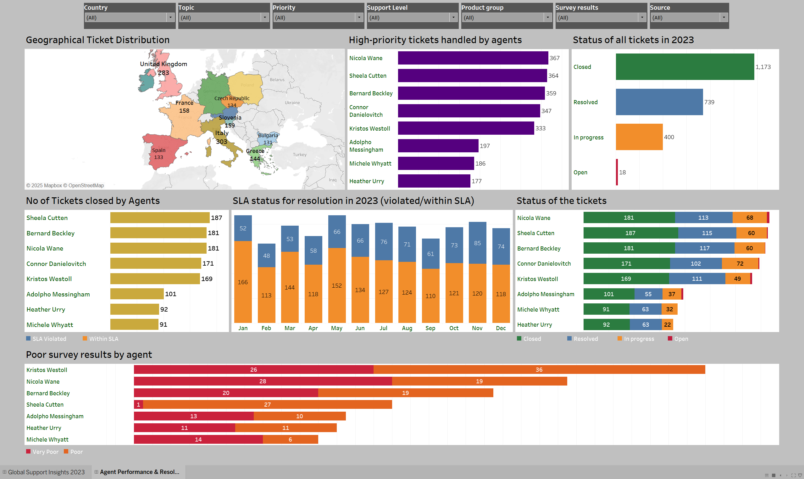

.png)

# **Technical Support & KPI Analysis (2023)**  

## **Project Summary**  
This project analyzes customer support data to identify trends in ticket distribution, agent performance, SLA compliance, and customer satisfaction. The goal is to generate actionable insights to enhance service efficiency, reduce SLA violations, and improve customer experience. The analysis leverages **Tableau** for visualization and data-driven decision-making.  

---

## **Data Overview**  

- **Source**: Internal Technical Support Ticket System  
- **Key Features**:  
  - **Ticket Distribution**: Country-wise breakdown, monthly trends  
  - **Support Channels**: Email, Chat, Phone  
  - **Categories**: Product Setup, Pricing & Licensing, Feature Requests, Bug Reports  
  - **Customer Satisfaction**: Survey Ratings (Excellent, Good, Poor, Very Poor)  
  - **Agent Performance**: Tickets Handled, Closed, SLA Violations  

- **Data Preparation**:  
  - **Cleaning & Aggregation**: Duplicates removed, missing values handled, ticket priorities categorized.  
  - **Metric Calculation**: Monthly ticket volume, SLA compliance rates, and agent performance KPIs.  
  - **Visualization in Tableau**: Interactive dashboards for ticket trends, survey results, and agent efficiency.  

---

## **Key Insights**  

- **Germany, Italy, and Poland** had the highest number of support tickets.  
- **Product Setup and Pricing & Licensing** were the most common support categories.  
- **Email** was the most frequently used support channel, followed by **Chat** and **Phone**.  
- **January and November** saw the highest number of ticket submissions, while **August had the lowest**.  
- **SLA violations peaked in February and May**, indicating delays in response times.  
- **Nicola Wane** handled the most tickets, but also received the highest negative feedback.  
- **Customer survey results**, with **113 "Very Poor"** and **128 "Poor"** ratings, highlighting areas for improvement.  

---

## **Recommendations**  

- Improve **response times** by optimizing agent workloads and automating responses for common issues.  
- Address **negative feedback trends** by providing additional training to underperforming agents.  
- Reduce **SLA violations** by implementing better workflow management and escalation processes.  
- Enhance customer experience by streamlining **self-service options** and FAQs.  
- Prioritize high-risk categories like **Feature Requests and Bug Reports** to improve product stability.  

---

## **Tools & Technologies**  

- **Tableau**: Data Visualization and Dashboard Creation  
- **Python (Pandas, NumPy)**: Data Preprocessing and KPI Calculation  
- **CSV**: Data Storage and Export for Tableau  

---
